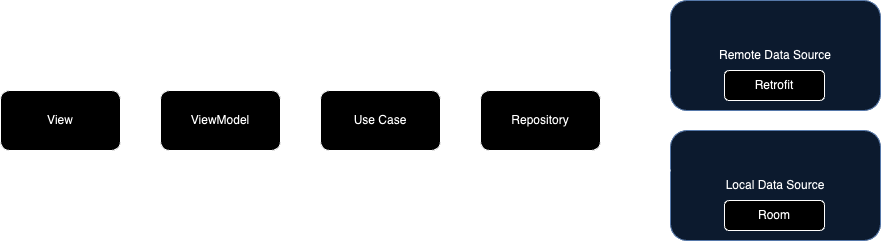

# Sportunity Android Assessment

## Prerequisites
- Swipe To Refresh functionality
- Paginated List
- Use XML views

## Architecture

* View which consists of a Single Activity and multiple Fragments, handles all UI components
* ViewModel holds the business logic which contains an use case
* Use Case is used to communicate with the repository so that Use Case methods can be used in other VMs
* Repository handles data received from the server. Currently no local DB is used but can be implemented here to add and retrieve data using Dao
  *  PagingDataSource is used to paginate network request.

### Design patterns used
- Dependency Injection Pattern
- Generic Repository Pattern
- Singleton Pattern
- Use Case Pattern

## Libraries & Frameworks
- [Coil](https://coil-kt.github.io/coil/) - Image Loader with memory caching
- [Dagger Hilt](https://dagger.dev/hilt/) -  Dependency injection
- [Detekt](https://github.com/detekt/detekt) - Static code analysis
- [Gradle Version Catalog](https://docs.gradle.org/8.1/userguide/platforms.html) - Gradle version catalog
- [Paging3](https://developer.android.com/topic/libraries/architecture/paging/v3-overview) - Paging Library
- [Junit4](https://junit.org/junit4/) - Testing Framework
- [Kotlin DSL](https://docs.gradle.org/current/userguide/kotlin_dsl.html)
- [Timber](https://github.com/JakeWharton/timber) - Logging
- [Retrofit2](https://square.github.io/retrofit/) using Gson Converter

## Possible Improvements
- Implement Viewpager to swipe between races
- Fix empty states
